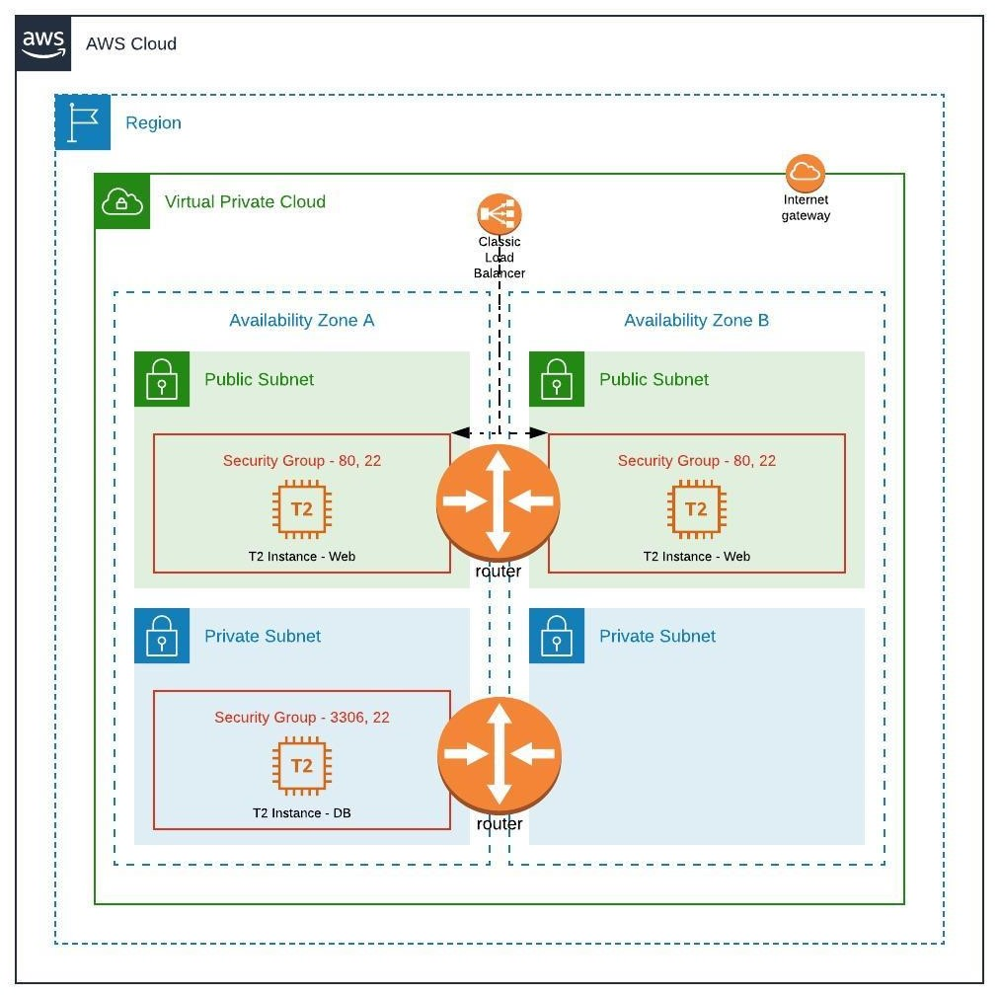

# What is this repository for?

This repository will help you install [Mediawiki](https://www.mediawiki.org) on AWS in fully automated fashion using Terraforma, AWS cli and Ansible.

Terraform is responsible for provisioning infrastructure on AWS while Ansible helps install Mediawiki.

## Diagrams - Infra


## Diagram - Execution
1. Traffic arrives on load balancer and get routed to web servers in public subnet
2. Web servers can only make calls to DB server in private subnet

## Useful links
1. Media Wiki installation steps [link](https://www.mediawiki.org/wiki/Manual:Running_MediaWiki_on_Debian_or_Ubuntu)
2. Enabling keyless authentication [link](https://www.digitalocean.com/community/tutorials/how-to-configure-ssh-key-based-authentication-on-a-linux-server)
3. Enabling passwordless sudo [link](https://code-maven.com/enable-ansible-passwordless-sudo)

## How to Execute Terrform Scripts

### Preparing Master Machine
Please refer to file - [master-setup-script.sh](master-setup-script.sh)
```
chmod 700 master-setup-script.sh
./master-setup-script.sh
```

### Plan
```
terrform plan
```

### Apply
```
terraform apply
```

### Destroy
```
terraform destroy
```

## Logs
1. terraform plan [Logs](static/terraform-plan.log)
2. terraform apply [Logs](static/terraform-apply.log)
3. terraform destroy [Logs](static/terraform-destroy.log)


## Passing DB password

### Option 1 using ansible vault (not used)
1. Open /etc/ansible/ansible.cfg
2. Update setting "vault_password_file" to point to a file where vault password is stored
3. [Reference](https://www.digitalocean.com/community/tutorials/how-to-use-vault-to-protect-sensitive-ansible-data-on-ubuntu-16-04)

### Option 2 passing through CI variable 
1. here for execution I have defined inside vars 
2. else Its possible to pass variable using TF_VAR_database_password through enviornment variable 


## to do 
1. trying out RDS module to handle DB operations from AWS instead of DB instance
2.  enable logging and monitoring using cloudwatch/ prometheus-grafana-lauki
3. launching mediawiki instance inside autoscaling group
4. CI CD setup and automation
5. try kubenrnets approach (work in progress)

For any questions, please write to me at ashishkamat91[at].gmail.com

## Application Launch 

**1. Mediawiki blog installation**


**2. Setup instruction**


**3. Database setup**


**4.wiki installation**


**5.wiki installation in progress**


**6.wiki installation complete**


**7.Landing Page**


## issues faced
1. username needs to be provided while execuitng playbook and keyfile (can be handled using group_vars)
2. db_instance in private subnet so have to excute ansible-playbook on that host via jumphost i.e any of the web-server -- fixed
3. media-wiki 1.35.1 require php7 or later which is available  in Ubuntu 20 --- fixed
4. DB instance creation stuck couple of times due to unable to update cache (unknown reason) .. work in progress -- fixed

